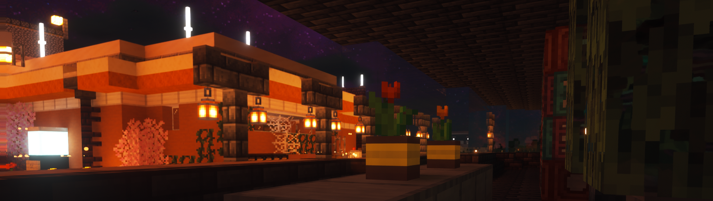

## 🎬 自述视频展示

  <!-- 深色模式显示动图，浅色模式显示 SVG -->
  <picture>
    <!-- 深色模式显示 GIF 动图 -->
    <source media="(prefers-color-scheme: dark)" srcset="https://raw.githubusercontent.com/qingtingjjjjjjj/qingtingjjjjjjj/main/assets/coding.gif">
    
    <!-- 浅色模式显示 SVG 静态图 -->
    <source media="(prefers-color-scheme: light)" srcset="https://raw.githubusercontent.com/qingtingjjjjjjj/qingtingjjjjjjj/main/assets/developer.svg">
    
    <!-- 默认显示 GIF -->
    
  </picture>

  <!-- knock code pictures 敲代码的图片 -->
  <picture>
    <source media="(prefers-color-scheme: dark)" srcset="https://cdn.jsdelivr.net/gh/qingtingjjjjjjj/qingtingjjjjjjj/assets/images/coding.gif" />
    <source media="(prefers-color-scheme: light)" srcset="https://cdn.jsdelivr.net/gh/qingtingjjjjjjj/qingtingjjjjjjj/assets/images/developer.svg" height="225px" />
    
  </picture>

  

<h2 align="center">
  「绕远的路，总有别样的风景。」
<picture>
  <source
    media="(prefers-color-scheme: dark)"
    srcset="https://raw.githubusercontent.com/qingtingjjjjjjj/qingtingjjjjjjj/output/github-contribution-grid-snake.svg"
  />
  <source
    media="(prefers-color-scheme: light)"
    srcset="https://raw.githubusercontent.com/qingtingjjjjjjj/qingtingjjjjjjj/output/github-contribution-grid-snake.svg"
  />
  
</picture>

    

 

 

  

<!-- 激励短语模块 -->
## 💪 激励短语

- “站出来，我会教你如何飞翔”
- 我最喜欢的《盲人守护者》歌曲《飞翔》讲述了灵感，让我想起我们的想象力是多么奇妙，以及我们如何通过“跳出框框思考”找到新的道路。
- “与其等待阳光，不如学会在雨中跳舞。”  
等待最佳时机去做某事毫无意义。那个时机可能永远不会到来。
- “当工作终于完成时，不要停下来，是时候去挖掘下一项了。”  
平克·弗洛伊德的《呼吸》这首歌提醒我，即使实现了一个宏伟的目标，也永远不要停下来。生活就是一个不断进步的过程。

<!-- 个人性格模块 -->
## 🧠 个人性格

在疑问和好奇心的驱使下，我总是想了解事物的运作原理，以及如何让它们运转起来。有了明确的目标，我就会执着地去实现它，直到找到问题的答案，我才会停下来。

## 访客量

    

